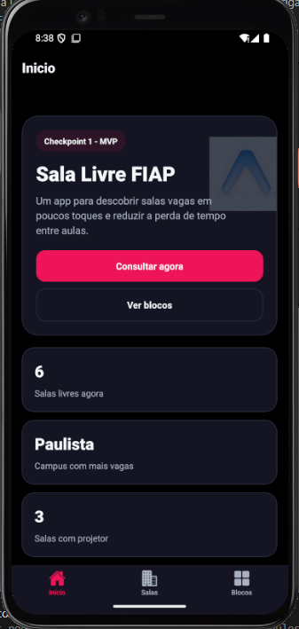
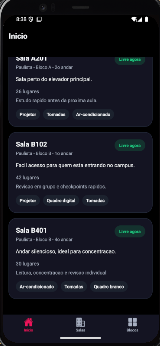
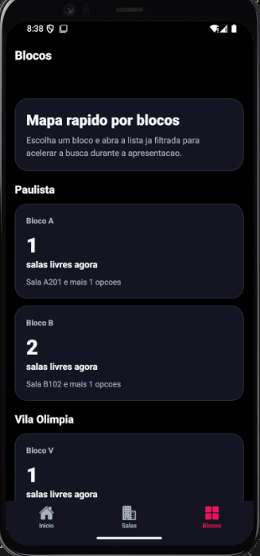
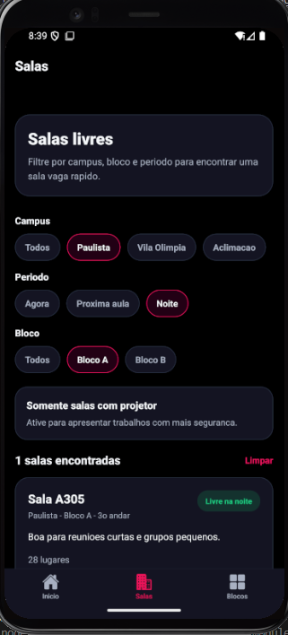

# 📱 Sala Livre FIAP

Aplicativo mobile desenvolvido com **React Native + Expo** para resolver um problema real do dia a dia na faculdade: encontrar rapidamente salas disponíveis entre as aulas.

---

## 🎯 Sobre o Projeto

O projeto nasceu da dificuldade recorrente de alunos em encontrar salas livres para:

* estudo
* reuniões em grupo
* ensaio de apresentações

A proposta é simples: **reduzir atrito e tempo perdido com um app direto, funcional e rápido**.

---

## 🚀 Evolução Técnica (CP1 → CP2)

### 🔹 CP1 (MVP)

* Consulta de salas com dados mockados
* Navegação entre telas
* Estrutura inicial do app

### 🔹 CP2 (Evolução completa)

* Autenticação real (login/cadastro)
* Persistência de sessão
* Proteção de rotas
* Estado global com Context API
* Persistência de reservas
* Validação de formulários
* Feedback visual com animações

---

## 🧠 Principais Melhorias Técnicas

* Autenticação completa com fluxo real
* Sessão persistida com restauração automática
* Rotas protegidas com redirecionamento inteligente
* Separação de responsabilidades:

  * `AuthContext`
  * `AppDataContext`
* Persistência de dados com fallback seguro
* Validação estruturada de formulários
* UX refinada com feedback visual (shake no erro)

---

## 🔐 Funcionalidades

### Autenticação e Sessão

* Cadastro com validações:

  * nome obrigatório
  * email válido
  * senha ≥ 6 caracteres
  * confirmação de senha
* Login com validação
* Logout
* Sessão persistida
* Controle de acesso por rota

---

### Estado Global e Persistência

* **AuthContext**

  * user
  * isAuthenticated
  * login / register / logout

* **AppDataContext**

  * reservations
  * toggleReservation
  * estado de loading

* Persistência local de:

  * usuário
  * sessão
  * reservas

---

### Consulta de Salas

* Indicadores na home:

  * salas livres agora
  * campus com mais vagas
  * reservas salvas
  * salas com projetor

* Filtros combinados:

  * campus
  * período (agora / próxima / noite)
  * bloco
  * projetor

* Estados:

  * loading simulado
  * vazio com CTA

---

### Detalhes da Sala

* Informações completas
* Disponibilidade por período
* Recursos
* Faixas livres do dia
* Reservar / cancelar
* Atalhos inteligentes de filtro

---

### UX e Feedback

* Erros inline em formulários
* Mensagens sem modal (menos intrusivo)
* Layout ajustado (sem overflow)
* Header com logout
* Animação de erro no login (shake)

---

## 📸 Demonstração

### 🧩 Telas Principais

<p align="center">
  
  
  
</p>

---

### 📱 Interface do App

<p align="center">
  
</p>

---

### 🚀 Versão CP2

<p align="center">
  
  
</p>

---

## 🎥 Vídeos

### CP1

https://drive.google.com/file/d/1O99ZvGE06YYFabAW29VARlZF7GHcoCZ6/view

### CP2

https://drive.google.com/file/d/1e01KDEZLQQwjI-wwwc9XRiINGMHqdCVw/view

---

## ⚙️ Como Rodar o Projeto

### Pré-requisitos

* Node.js
* Expo Go (ou emulador Android/iOS)

### Instalação

```bash
git clone https://github.com/CezarBacanieski/cp-mobile-oficial.git
cd cp-mobile-oficial
npm install
npx expo start
```

### Execução

* Pressione `a` → Android
* Ou escaneie o QR Code → Expo Go

---

## 🏗️ Estrutura do Projeto

```bash
app/
  (tabs)/
    index.tsx
    salas.tsx
    blocos.tsx
  sala/[id].tsx
  login.tsx
  cadastro.tsx

contexts/
  auth-context.tsx
  app-data-context.tsx

components/
lib/
constants/
```

---

## 🧩 Decisões Técnicas

* Expo Router (file-based routing)
* Context API para estado global
* AsyncStorage com fallback
* Hooks nativos (`useState`, `useEffect`, `useMemo`)
* Componentização com StyleSheet
* Dados mockados (escopo acadêmico)

---

## ⭐ Diferencial

* Animação de erro no login com `Animated API`

  * feedback imediato
  * melhora percepção de UX

---

## ✅ Checklist

### CP1

* [x] Expo
* [x] Navegação
* [x] 3+ telas
* [x] Componentização
* [x] Hooks
* [x] Estilização
* [x] Feedback visual

### CP2

* [x] Autenticação
* [x] Persistência
* [x] Context API
* [x] Validação de formulários
* [x] Diferencial implementado

---

## 👥 Integrantes

* Lorenzo Hayashi Mangini — RM 554901
* Milton Cezar Bacanieski — RM 555206
* Vitor Bebiano Mulford — RM 555026
* Victorio Maia Bastelli — RM 554723
